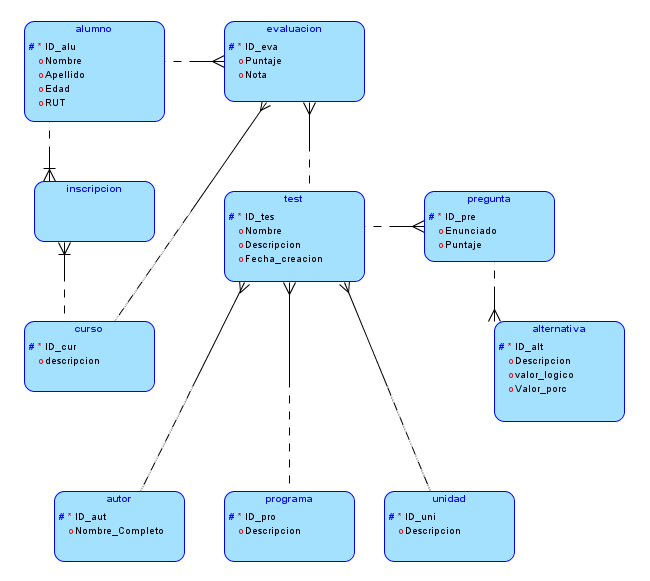
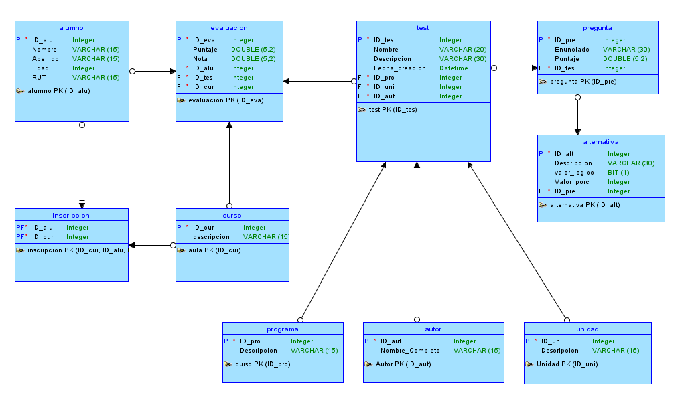
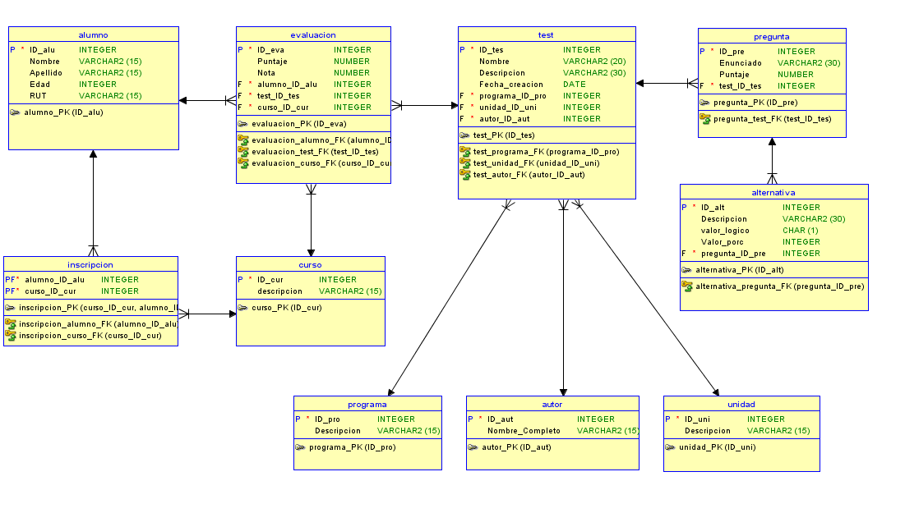

# Evaluacion de cierre Modulo 2
Se solicita que el desarrollo del ejercicio contenga los siguientes elementos:

- Modelo lógico en OracleDataModeler. 
- Modelo relacional en OracleDataModeler.
- DDL generado por OracleDataModeler.
- Script SQL que registre al menos 2 evaluaciones, con 10 preguntas y 4 alternativas.
- Script SQL que registre al menos 2 cursos de 10 estudiantes que respondan estas evaluaciones.
- Script SQL que responda las preguntas solicitadas.

## Modelos Base

### Modelo Lógico

_A continucación se muestra el mapa lógico:_ 






### Modelo Relacional

_Se muestra el modelo relacional de la solución presentada_




# Modelo DDL
Este es código para implementar la estructura de la base de datos
```sql
CREATE TABLE alternativa (
    id_alt           INTEGER NOT NULL,
    descripcion      VARCHAR2(30),
    valor_logico     CHAR(1),
    valor_porc       INTEGER,
    pregunta_id_pre  INTEGER NOT NULL
);

ALTER TABLE alternativa
    ADD CHECK ( valor_logico IN ( 'F', 'V' ) );

ALTER TABLE alternativa ADD CONSTRAINT alternativa_pk PRIMARY KEY ( id_alt );

CREATE TABLE alumno (
    id_alu    INTEGER NOT NULL,
    nombre    VARCHAR2(15),
    apellido  VARCHAR2(15),
    edad      INTEGER,
    rut       VARCHAR2(15)
);

ALTER TABLE alumno ADD CONSTRAINT alumno_pk PRIMARY KEY ( id_alu );

CREATE TABLE autor (
    id_aut           INTEGER NOT NULL,
    nombre_completo  VARCHAR2(15)
);

ALTER TABLE autor ADD CONSTRAINT autor_pk PRIMARY KEY ( id_aut );

CREATE TABLE curso (
    id_cur       INTEGER NOT NULL,
    descripcion  VARCHAR2(15)
);

ALTER TABLE curso ADD CONSTRAINT curso_pk PRIMARY KEY ( id_cur );

CREATE TABLE evaluacion (
    id_eva         INTEGER NOT NULL,
    puntaje        NUMBER,
    nota           NUMBER,
    alumno_id_alu  INTEGER NOT NULL,
    test_id_tes    INTEGER NOT NULL,
    curso_id_cur   INTEGER NOT NULL
);

ALTER TABLE evaluacion
    ADD CHECK ( nota BETWEEN 1.0 AND 7.0 );

ALTER TABLE evaluacion ADD CONSTRAINT evaluacion_pk PRIMARY KEY ( id_eva );

CREATE TABLE inscripcion (
    alumno_id_alu  INTEGER NOT NULL,
    curso_id_cur   INTEGER NOT NULL
);

ALTER TABLE inscripcion ADD CONSTRAINT inscripcion_pk PRIMARY KEY ( curso_id_cur,
                                                                    alumno_id_alu );

CREATE TABLE pregunta (
    id_pre       INTEGER NOT NULL,
    enunciado    VARCHAR2(30),
    puntaje      NUMBER,
    test_id_tes  INTEGER NOT NULL
);

ALTER TABLE pregunta ADD CONSTRAINT pregunta_pk PRIMARY KEY ( id_pre );

CREATE TABLE programa (
    id_pro       INTEGER NOT NULL,
    descripcion  VARCHAR2(15)
);

ALTER TABLE programa ADD CONSTRAINT programa_pk PRIMARY KEY ( id_pro );

CREATE TABLE test (
    id_tes           INTEGER NOT NULL,
    nombre           VARCHAR2(20),
    descripcion      VARCHAR2(30),
    fecha_creacion   DATE,
    programa_id_pro  INTEGER NOT NULL,
    unidad_id_uni    INTEGER NOT NULL,
    autor_id_aut     INTEGER NOT NULL
);

ALTER TABLE test ADD CONSTRAINT test_pk PRIMARY KEY ( id_tes );

CREATE TABLE unidad (
    id_uni       INTEGER NOT NULL,
    descripcion  VARCHAR2(15)
);

ALTER TABLE unidad ADD CONSTRAINT unidad_pk PRIMARY KEY ( id_uni );

ALTER TABLE alternativa
    ADD CONSTRAINT alternativa_pregunta_fk FOREIGN KEY ( pregunta_id_pre )
        REFERENCES pregunta ( id_pre );

ALTER TABLE evaluacion
    ADD CONSTRAINT evaluacion_alumno_fk FOREIGN KEY ( alumno_id_alu )
        REFERENCES alumno ( id_alu );

ALTER TABLE evaluacion
    ADD CONSTRAINT evaluacion_curso_fk FOREIGN KEY ( curso_id_cur )
        REFERENCES curso ( id_cur );

ALTER TABLE evaluacion
    ADD CONSTRAINT evaluacion_test_fk FOREIGN KEY ( test_id_tes )
        REFERENCES test ( id_tes );

ALTER TABLE inscripcion
    ADD CONSTRAINT inscripcion_alumno_fk FOREIGN KEY ( alumno_id_alu )
        REFERENCES alumno ( id_alu );

ALTER TABLE inscripcion
    ADD CONSTRAINT inscripcion_curso_fk FOREIGN KEY ( curso_id_cur )
        REFERENCES curso ( id_cur );

ALTER TABLE pregunta
    ADD CONSTRAINT pregunta_test_fk FOREIGN KEY ( test_id_tes )
        REFERENCES test ( id_tes );

ALTER TABLE test
    ADD CONSTRAINT test_autor_fk FOREIGN KEY ( autor_id_aut )
        REFERENCES autor ( id_aut );

ALTER TABLE test
    ADD CONSTRAINT test_programa_fk FOREIGN KEY ( programa_id_pro )
        REFERENCES programa ( id_pro );

ALTER TABLE test
    ADD CONSTRAINT test_unidad_fk FOREIGN KEY ( unidad_id_uni )
        REFERENCES unidad ( id_uni );

```
## Inserción de datos
_Agregamos alumnos_

```sql
INSERT ALL
    INTO alumno (id_alu,nombre,apellido,edad,rut) VALUES (1,'Antonio', 'Chavez', 45, '12686988-6')
    INTO alumno (id_alu,nombre,apellido,edad,rut) VALUES (2,'Alfonso', 'Gonzalez', 25, '13368831-5')
    INTO alumno (id_alu,nombre,apellido,edad,rut) VALUES (3,'Ivan', 'Mora', 19, '15451443-0')
    INTO alumno (id_alu,nombre,apellido,edad,rut) VALUES (4,'Pedro', 'Aravena', 32, '23738418-0')
    INTO alumno (id_alu,nombre,apellido,edad,rut) VALUES (5,'Luis', 'Parra', 48, '16141803-k')
    INTO alumno (id_alu,nombre,apellido,edad,rut) VALUES (6,'German', 'Varas', 39, '14699196-3')
    INTO alumno (id_alu,nombre,apellido,edad,rut) VALUES (7,'Ignacio', 'Loyola', 24, '12402724-1')
    INTO alumno (id_alu,nombre,apellido,edad,rut) VALUES (8,'Carlos', 'Carrasco', 23, '20910782-1')
    INTO alumno (id_alu,nombre,apellido,edad,rut) VALUES (9,'Francisco', 'Perez', 28, '15930470-1')
    INTO alumno (id_alu,nombre,apellido,edad,rut) VALUES (10,'Esteban', 'Montes', 31, '12386977-k')
    INTO alumno (id_alu,nombre,apellido,edad,rut) VALUES (11,'Alejandro', 'Silva', 33, '11952539-k')
    INTO alumno (id_alu,nombre,apellido,edad,rut) VALUES (12,'Patricio', 'Vasquez', 19, '18335291-1')
    INTO alumno (id_alu,nombre,apellido,edad,rut) VALUES (13,'David', 'Gomez', 20, '17946010-6')
    INTO alumno (id_alu,nombre,apellido,edad,rut) VALUES (14,'Miguel', 'Urrutia', 21, '24326063-9')
    INTO alumno (id_alu,nombre,apellido,edad,rut) VALUES (15,'Rodrigo', 'Saa', 27, '12383751-7')
    INTO alumno (id_alu,nombre,apellido,edad,rut) VALUES (16,'Jaime', 'Padilla', 42, '8450259-6')
    INTO alumno (id_alu,nombre,apellido,edad,rut) VALUES (17,'Jose', 'Lopez', 39, '14043872-3')
    INTO alumno (id_alu,nombre,apellido,edad,rut) VALUES (18,'Felipe', 'Vial', 35, '13518147-1')
    INTO alumno (id_alu,nombre,apellido,edad,rut) VALUES (19,'Horacio', 'Guzman', 34, '11606040-k')
    INTO alumno (id_alu,nombre,apellido,edad,rut) VALUES (20,'Mario', 'Torres', 48, '15713854-5')
    
    SELECT * FROM dual;
```
_Agregamos programas_

```sql
INSERT ALL
    INTO programa (ID_pro,Descripcion) VALUES (1,'Full Strack Java')
    INTO programa (ID_pro,Descripcion) VALUES (2,'Desarrollo de aplicaciones moviles')
    INTO programa (ID_pro,Descripcion) VALUES (3,'Diseñador UX/UI')
    INTO programa (ID_pro,Descripcion) VALUES (4,'Analista de Datos')
    
SELECT * FROM dual;
```
_Agregamos unidades_

```sql
INSERT ALL
    INTO unidad (ID_uni,Descripcion) VALUES (1,'Unidad 1')
    INTO unidad (ID_uni,Descripcion) VALUES (2,'Unidad 2')
    INTO unidad (ID_uni,Descripcion) VALUES (3,'Unidad 3')
    INTO unidad (ID_uni,Descripcion) VALUES (4,'Unidad 4')
     
SELECT * FROM dual;
```

_Agregamos Cursos (aulas)_

```sql
INSERT ALL
    INTO curso (ID_cur,Descripcion) VALUES (1,'Grupo 003')
    INTO curso (ID_cur,Descripcion) VALUES (2,'Grupo 025')
    INTO curso (ID_cur,Descripcion) VALUES (3,'Grupo 039')
    INTO curso (ID_cur,Descripcion) VALUES (4,'Grupo 042')
    INTO curso (ID_cur,Descripcion) VALUES (5,'Grupo 057')
     
SELECT * FROM dual;
```
_Agregamos Autores de Test_

```sql
INSERT ALL
    INTO autor (ID_aut,nombre_completo) VALUES (1,'Jimmy')
    INTO autor (ID_aut,nombre_completo) VALUES (2,'Jarvis')
    INTO autor (ID_aut,nombre_completo) VALUES (3,'HAL 9000')
    INTO autor (ID_aut,nombre_completo) VALUES (4,'Skynet')
     
SELECT * FROM dual;
```
_Agregamos algunos Test_

```sql
INSERT ALL
    INTO test (ID_tes,nombre,descripcion,fecha_creacion,programa_ID_pro,unidad_ID_uni,autor_id_aut) VALUES (1,'Dia del juicio','Unidad 1 de JAVA',TO_DATE('01-05-2020', 'DD-MM-YYYY'),1,1,3)
    INTO test (ID_tes,nombre,descripcion,fecha_creacion,programa_ID_pro,unidad_ID_uni,autor_id_aut) VALUES (2,'Apocalipsis','Unidad 1 JAVA',TO_DATE('01-06-2020', 'DD-MM-YYYY'),2,1,1)
    INTO test (ID_tes,nombre,descripcion,fecha_creacion,programa_ID_pro,unidad_ID_uni,autor_id_aut) VALUES (3,'Ilusos','Unidad 2 SQL',TO_DATE('01-07-2020', 'DD-MM-YYYY'),2,2,1)
    
SELECT * FROM dual

```
_Agregamos Preguntas de selección multiple_

```sql
INSERT ALL
    INTO pregunta (ID_pre,enunciado,puntaje,test_id_tes) VALUES (1,'Que es JAVA',5,2)
    INTO pregunta (ID_pre,enunciado,puntaje,test_id_tes) VALUES (2,'Cuales son IDE de JAVA',5,2)
    INTO pregunta (ID_pre,enunciado,puntaje,test_id_tes) VALUES (3,'Como defines un Constructor',10,2)
    INTO pregunta (ID_pre,enunciado,puntaje,test_id_tes) VALUES (4,'Propiedades de una Clase JAVA',5,2)
    INTO pregunta (ID_pre,enunciado,puntaje,test_id_tes) VALUES (5,'Proposito de encapsulacion',20,2)
    INTO pregunta (ID_pre,enunciado,puntaje,test_id_tes) VALUES (6,'Caracteristicas de Interfaz',10,2)
    INTO pregunta (ID_pre,enunciado,puntaje,test_id_tes) VALUES (7,'ARRAY v/s ARRAY list',10,2)
    INTO pregunta (ID_pre,enunciado,puntaje,test_id_tes) VALUES (8,'Manejo de excepciones con:',10,2)
    INTO pregunta (ID_pre,enunciado,puntaje,test_id_tes) VALUES (9,'Clases en colecciones',10,2)
    INTO pregunta (ID_pre,enunciado,puntaje,test_id_tes) VALUES (10,'Conceptos de OOPS',15,2)
    INTO pregunta (ID_pre,enunciado,puntaje,test_id_tes) VALUES (11,'Que es DDL',10,3)
    INTO pregunta (ID_pre,enunciado,puntaje,test_id_tes) VALUES (12,'Identifique BD. relacional',10,3)
    INTO pregunta (ID_pre,enunciado,puntaje,test_id_tes) VALUES (13,'Sentencias DDL',15,3)
    INTO pregunta (ID_pre,enunciado,puntaje,test_id_tes) VALUES (14,'Sentencias DML',15,3)
    INTO pregunta (ID_pre,enunciado,puntaje,test_id_tes) VALUES (15,'Uso de SELECT',15,3)
    INTO pregunta (ID_pre,enunciado,puntaje,test_id_tes) VALUES (16,'Clave Primaria',15,3)
    INTO pregunta (ID_pre,enunciado,puntaje,test_id_tes) VALUES (17,'Identifique los SGBD',15,3)
    INTO pregunta (ID_pre,enunciado,puntaje,test_id_tes) VALUES (18,'Que es SQL',5,3)
    
SELECT * FROM dual;
```


